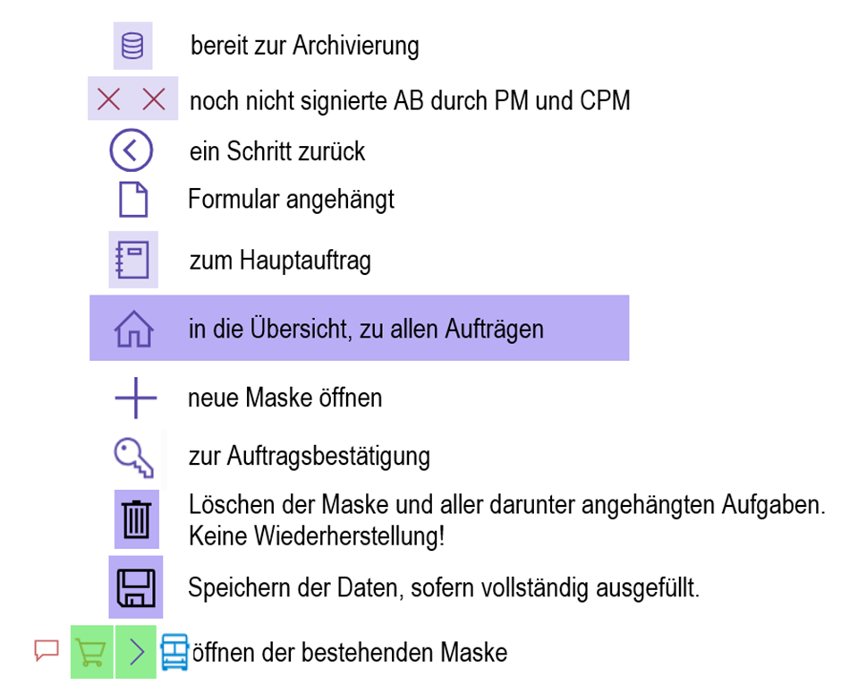

# **Workflow Tool Powerapps für User**
## **Dokumentation**

## Inhalt:

1. Zweck
2. Legende
3. StartScreen
4. Home-Screen
5. Auftrag-Screen
6. Signierung-Screen
7. Bemerkung-Screen
8. Materialbestellung-Screen
9. Archiv-Screen
10. Archivauftrag-Screen
11. Archivmaterialbestellung-Screen

### 1. Zweck

Powerapps ist ein Tool von Microsoft, welches verwendet wird um Inhouse-Tools bzw. Softwares zu erstellen. 
 Dafür braucht man keine umfangreiche Programmierkenntnisse und kann die Software benutzerdefiniert erstellen.

Die Siemens-Energy AG nutzt PowerApps für ihren Bestellworkflow. Dort kann jeder Mitarbeiter Bestellungen erfassen. Die Werkstudenten sind für das Codieren der Seite zuständig und ist immer in Austausche mit den Admins der App.

### 2. Legende

Anhand von der Legende kann man die verschiedenen Icons und deren Bedeutung erkennen. 
 Diese Icons sind auf den verschiedenen Screens zu finden und helfen bei der Navigation.

Erklärung:

- `WF angelegt`: Noch nicht zur Auftragserfassung gesendet
- `WF zur Bearbeitung`: In der Auftragserfassung
- `AEB gesendet`: Kundenauftrag im SAP angelegt
- `AB gesendet`: Lieferterminbestätigung erhalten
- `Abgeschlossen`: Fakturadatum erreicht, Weiterleitung zur Verrechnung
- `Faturierung`: Beim CPM zur Verrechnung
- `Archivierung`: Verrechnet, bereit zur Archivierung

Erklärung:

- `Materialbestellung angelegt`: Noch nicht zur Auftragserfassung gesendet
- `Workflow zur Bearbeitung`: In der Auftragserfassung
- `Bestellung angelegt`: Noch nicht an den Lieferanten gesendet
- `Bestellung an den Lieferanten gesendet`
- `Lieferantenbestätigung erhalten`: Lieferantenreferenz, Liefertermin

### 3. StartScreen

Im `Start-Screen` kann man sich zu folgenden Pages navigieren lassen:

- `Neuen Auftrag erfassen`: Hier gelangt man zum Auftrag-Screen
- `Übersicht`: Hier gelangt man zum Home-Screen
- `Archiv`: Hier gelangt man zum Archiv-Screen
- Mit den `Pfeiltasten` am Unteren Rand kann man sich durch einen kleinen Tutorial navigieren, der die wichtigsten Funktionen erklärt.

### 4. Home-Screen

Im `Home-Screen` sind alle Bestellungen ersichtlich. Durch die Filter Funktion kann man gezielt nach einem Auftrag suchen. 
 Durch die `+` - Taste kann man auch einen neuen Auftrag erfassen.

Auf diesen Screen kann man die vorhandenen Materialbestellungen, Transporte und auch Bemerkungen einsehen oder auch erstellen. 
 Dafür muss man in der jeweiligen Liste auf das Kreuz klicken und man gelangt in der entsprechende Seite.

### 5. Auftrag-Screen

Im `Auftrag-Screen` kann man einen neuen Auftrag erfassen. 
 Wichtig dabei ist, dass man hier die Felder mit den `*` markiert ausfüllen muss, damit der Auftrag auch gespeichert werden kann. 
 Sobald dieser gespeichert wurde, wird er im `Home-Screen` angezeigt und kann dort auch bearbeitet werden.

In diesem Screen sieht man ein Beispielauftrag, welcher bereits erfasst wurde und auch signiert ist. Ist das Faktura Plandatum erreicht wird eine Automatische E-Mail an den PM gesendet damit abgeklärt wird ob der Auftrag verrechnet werden kann. 
 Ist der Auftrag abgeschlossen kann der PM über den `Auftrag verrechnen`-Button den Auftrag abschliessen. 
 Der Auftrag wird dann im `Archiv-Screen` angezeigt und kann dort auch nicht mehr bearbeitet werden. 
 Sollte der Auftrag bis zum Faktura Plandatum nicht abgeschlossen sein, kann das Datum in die Zukunft verschoben werden und das Prozedere beginnt von vorne.

### 6. Signierung-Screen

Der `Signierung-Screen` ist dafür da, ein Projekt zu Unterschreiben und diesen als freigegeben zu deklarieren.

### 7. Bemerkung-Screen

Im `Bemerkung-Screen` werden die Bemerkungen zu einem Auftrag erfasst. 
 Zusätzlich kann man auch die dazugehörigen Anhänge mitversenden. Sobald die Bemerkung gespeichert wird, wird sie im `Home-Screen` angezeigt.

Auf diesem Screen sieht man wie es aussieht, wenn eine Bemerkung bereits erfasst wurde.

### 8. Materialbestellung-Screen

Im `Materialbestellung-Screen` werden die Bestellungen erfasst. Man trägt die Daten ein sowie auch die Termine wie beispielsweise `Lieferbestätigung bis` oder `PO Datum`. Damit hat man Deadlines. Ebenfalls kann man Anhänge oder Bemerkungen  hinzufügen <Bei Bemerkung erfasst man diese im `Bemerkung-Screen`>

### 9. Archiv-Screen

Im `Archiv-Screen` sieht man alle archivierten Bestellungen. Man kann in die einzelnen bestellungen auch klicken, jedoch sind diese unveränderbar, da sie schon abgeschlossen sind.

### 10. Archivauftrag-Screen

Der `Archivauftrag-Screen` ist dem `Archiv-Screen` unterstellt. Dieser zeigt den `Auftrag-Screen` des abgeschlossenen Auftrags vom `Archiv-Screen`.

### 11. Archivmaterialbestellung-Screen

Der `Archivmaterialbestellung-Screen` ist dem `Archiv-Screen` unterstellt. Dieser zeigt den `Materialbestellung-Screen` des abgeschlossenen Auftrags vom `Archiv-Screen`.

