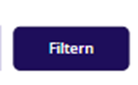

# **Workflow Tool Powerapps und Powerautomate für Coder**
## **Dokumentation**

## **Inhalt:**
1. Grundlagen Powerapps
2. Grundlagen des Einfpgens von Elementen
3. Legende von Properties
4. App und Start-Screen
5. Home-Screen
6. Auftrag-Screen


## **1. Grundlagen Powerapps**

In diesem Kapitel werden die relevantesten Funktionen erläutert, die für die Entwicklung von Apps in Powerapps erforderlich sind.

### **Grundfunktionen**

- `If()`: Wenn etwas zutrifft, dann mach dies, sonst mach das.  
  > ***z. B.*** Wenn Alter über 18, dann "Erwachsen", sonst "Kind"
- `Switch()`: Für mehrere Bedingungen. ähnlich wie `If()`, aber für mehrere Fälle.  
  > ***z. B.*** Wenn Alter 0-12, dann "Kind", 13-19, dann "Teenager", sonst "Erwachsen"
- `Notify()`:Zeigt eine kleien Nachricht in der App an.  
  > ***z. B.*** "Daten erfolgreich gespeichert"
- `Navigate()`: Navigiert zu einem anderen Bildschirm in der App.  
  > ***z. B.*** `Navigate(Screen2, ScreenTransition.Fade)`
- `Back()`: Geht zum vorherigen Bildschirm zurück.  
  > ***z. B.*** `Back()`
- `Exit()`: Beendet die App.  
  > ***z. B.*** `Exit()`

### **Textfunktionen**
- `Text()`: Formatiert eine Zahl oder ein Datum als Text.  
  > ***z. B.*** `Text(1234.56, "[$-de-DE]#,##0.00")` formatiert die Zahl als deutschen Währungsbetrag.
- `Value()`: Konvertiert Text in eine Zahl.  
  > ***z. B.*** `Value("1234.56")` gibt die Zahl 1234.56 zurück.
- `Len()`: Gibt die Länge eines Textes zurück.  
  > ***z. B.*** `Len("Hallo")` gibt 5 zurück.
- `Left()`, `Right()`, `Mid()`: Extrahieren Teile eines Textes.
    > ***z. B.*** `Left("Hallo", 2)` gibt **Ha** zurück, <p></p> `Right("Hallo", 2)` gibt **lo** zurück, <p></p> `Mid("Hallo", 2, 3)` gibt **all** zurück.
- `Upper()`, `Lower()`: Wandeln Text in Groß- oder Kleinschreibung um.
    > ***z. B.*** `Upper("Hallo")` gibt **HALLO** zurück, <p></p> `Lower("HALLO")` gibt **hallo** zurück.
`Trim()`: Entfernt Leerzeichen am Anfang und Ende eines Textes.  
  > ***z. B.*** `Trim("  Hallo  ")` gibt "Hallo" zurück.

### **Mathematikfunktionen**
- `Round()`: Rundet eine Zahl auf eine bestimmte Anzahl von Dezimalstellen.  
  > ***z. B.*** `Round(123.456, 2)` gibt 123.46 zurück.
- `Abs()`: Gibt den Absolutwert einer Zahl zurück.  
  > ***z. B.*** `Abs(-5)` gibt 5 zurück.
- `Sqrt()`: Gibt die Quadratwurzel einer Zahl zurück.  
  > ***z. B.*** `Sqrt(16)` gibt 4 zurück.
- `Rand()`: Gibt eine Zufallszahl zwischen 0 und 1 zurück.  
  > ***z. B.*** `Rand()` gibt eine Zufallszahl wie 0.123456 zurück.
- `Mod()`: Gibt den Rest einer Division zurück.  
  > ***z. B.*** `Mod(10, 3)` gibt 1 zurück, da 10 geteilt durch 3 einen Rest von 1 hat.
  > 

### **Logikfunktionen**
- `And()`, `Or()`, `Not()`: Logische Operatoren für Bedingungen.  
  > ***z. B.*** `If(And(Age > 18, IsStudent), "Erwachsen und Student", "Nicht erwachsen oder kein Student")`
  > `If(Or(Age < 18, IsStudent), "Kind oder Student", "Erwachsen und kein Student")`
- `IsBlank()`: Überprüft, ob ein Wert leer ist.  
  > ***z. B.*** `If(IsBlank(TextInput1.Text), "Feld ist leer", "Feld hat Inhalt")`
- `IsEmpty()`: Überprüft, ob eine Sammlung, Liste ider Tabelle leer ist.  
  > ***z. B.*** `If(IsEmpty(MyCollection), "Sammlung ist leer", "Sammlung hat Elemente")`
- `IsNumeric()`: Überprüft, ob ein Wert numerisch ist.  
  > ***z. B.*** `If(IsNumeric(TextInput1.Text), "Ist eine Zahl", "Ist keine Zahl")`
- `IsError()`: Überprüft, ob ein Ausdruck einen Fehler zurückgibt.  
  > ***z. B.*** `If(IsError(LookUp(MyTable, ID = 1)), "Fehler beim Suchen", "Suche erfolgreich")`

### **Datum- und Zeitfunktionen**
- `Now()`: Gibt das aktuelle Datum und die aktuelle Uhrzeit zurück.  
  > ***z. B.*** `Now()` gibt etwas wie "2023-10-01 12:34:56" zurück.
- `Today()`: Gibt das aktuelle Datum zurück (ohne Uhrzeit).  
  > ***z. B.*** `Today()` gibt "2023-10-01" zurück.
- `Date()`: Erstellt ein Datum aus Jahr, Monat und Tag.  
  > ***z. B.*** `Date(2023, 10, 1)` gibt "2023-10-01" zurück.
- `DateAdd()`: Fügt einem Datum eine bestimmte Anzahl von Tagen, Monaten oder Jahren hinzu.  
  > ***z. B.*** `DateAdd(Today(), 7, Days)` gibt das Datum in 7 Tagen zurück.
- `DateDiff()`: Berechnet die Differenz zwischen zwei Daten in Tagen, Monaten oder Jahren.  
  > ***z. B.*** `DateDiff(Today(), Date(2023, 12, 31), Days)` gibt die Anzahl der Tage bis zum 31. Dezember 2023 zurück.
- `Year()`, `Month()`, `Day()`: Extrahieren Jahr, Monat oder Tag aus einem Datum.  
  > ***z. B.*** `Year(Today())` gibt das aktuelle Jahr zurück, `Month(Today())` den aktuellen Monat, `Day(Today())` den aktuellen Tag.
- `Weekday()`: Gibt den Wochentag eines Datums zurück (1 = Sonntag, 2 = Montag, ...).  
  > ***z. B.*** `Weekday(Today())` gibt den aktuellen Wochentag zurück.
- `FormatDateTime()`: Formatiert ein Datum als Text.  
  > ***z. B.*** `FormatDateTime(Today(), DateTimeFormat.LongDate)` gibt das Datum im langen Format zurück, z. B. "1. Oktober 2023".

### **Listen und Daten**
- `Collect()`: Fügt Elemente zu einer Sammlung hinzu.  
  > ***z. B.*** `Collect(MyCollection, {Name: "Max", Age: 30})` fügt ein Objekt mit Name und Alter zur Sammlung hinzu.
- `Clear()`: Löscht alle Elemente aus einer Sammlung.  
  > ***z. B.*** `Clear(MyCollection)` entfernt alle Elemente aus der Sammlung.
- `ClearCollect()`: Löscht eine Sammlung und fügt dann neue Elemente hinzu.  
  > ***z. B.*** `ClearCollect(MyCollection, {Name: "Max", Age: 30})` löscht die Sammlung und fügt ein neues Objekt hinzu.
- `Remove()`: Entfernt ein bestimmtes Element aus einer Sammlung.  
  > ***z. B.*** `Remove(MyCollection, {Name: "Max", Age: 30})` entfernt das Objekt mit Name "Max" und Alter 30 aus der Sammlung.
- `RemoveIf()`: Entfernt Elemente aus einer Sammlung, die eine bestimmte Bedingung erfüllen.  
  > ***z. B.*** `RemoveIf(MyCollection, Age < 18)` entfernt alle Objekte aus der Sammlung, bei denen das Alter unter 18 ist.
- `Patch()`: Aktualisiert oder fügt ein Element in einer Sammlung hinzu.  
  > ***z. B.*** `Patch(MyCollection, {Name: "Max"}, {Age: 31})` aktualisiert das Alter des Objekts mit Name "Max" auf 31.
- `Sort()`: Sortiert eine Sammlung nach einem bestimmten Feld.  
  > ***z. B.*** `Sort(MyCollection, Age, Ascending)` sortiert die Sammlung nach dem Alter in aufsteigender Reihenfolge.
- `SortByColumns()`: Sortiert eine Sammlung nach mehreren Spalten.  
  > ***z. B.*** `SortByColumns(MyCollection, "Name", Ascending, "Age", Descending)` sortiert zuerst nach Name aufsteigend und dann nach Alter absteigend.
- `Filter()`: Filtert eine Sammlung nach einer Bedingung.  
  > ***z. B.*** `Filter(MyCollection, Age > 18)` gibt alle Objekte zurück, bei denen das Alter über 18 ist.

### **Suchen und Filtern**
- `LookUp()`: Sucht ein einzelnes Element in einer Sammlung, das eine bestimmte Bedingung erfüllt.  
  > ***z. B.*** `LookUp(MyCollection, Name = "Max")` gibt das Objekt mit Name "Max" zurück.
- `Search()`: Sucht nach einem Text in einer Sammlung.  
  > ***z. B.*** `Search(MyCollection, "Max", "Name")` gibt alle Objekte zurück, bei denen der Name "Max" enthält.
- `First()`, `Last()`: Gibt das erste oder letzte Element einer Sammlung zurück.  
  > ***z. B.*** `First(MyCollection)` gibt das erste Objekt in der Sammlung zurück, <p></p> `Last(MyCollection)` das letzte.
- `FirstN()`, `LastN()`: Gibt die ersten oder letzten N Elemente einer Sammlung zurück.  
  > ***z. B.*** `FirstN(MyCollection, 3)` gibt die ersten 3 Objekte zurück, <p></p> `LastN(MyCollection, 2)` die letzten 2.
- `Distinct()`: Gibt eine Sammlung von eindeutigen Werten aus einer bestimmten Spalte zurück.  
  > ***z. B.*** `Distinct(MyCollection, Name)` gibt eine Liste aller eindeutigen Namen in der Sammlung zurück.
- `StartsWith()`, `EndsWith()`: Überprüfen, ob ein Text mit einem bestimmten Präfix oder Suffix beginnt oder endet.  
  > ***z. B.*** `StartsWith("Hallo", "Ha")` gibt `true` zurück, <p></p> `EndsWith("Hallo", "lo")` gibt ebenfalls `true` zurück.


## **2. Grundlagen des Einfügens von Elementen**

In diesem Kapitel werden die Grundlagen des Einfügens von Elementen in Powerapps erläutert, einschliesslich der Verwendung von Steuerelementen und deren Eigenschaften.

Damit man ein Element in Powerapps einfügen kann, muss man im Sharepoint das Element speichern. Für Powerapps ist Sharepoint eine Datenbank und dort wird alles gespeichert.

- Dafür gehst du auf der RC-CH-Workflow


- Bei der gelben Markierung findest du alle Sharepoint-Listen, die du für deine App verwenden kannst.  
  > ***z. B.*** `RC-CH.Workflow` ist eine Liste, in der du deine Workflows speichern kannst.


- Ganz rechts auf `Add Column` erstellt man eine Spalte nach Wunsch / Vorgabe. Danach wird dies gespeichert.


- Ganz wichtig: Auf der Powerapps-Seite musst du die Liste `refreshen`, da diese ergänzt wurde.


- Unter `Properties` &rarr; `Display` &rarr; `Edit fields` &rarr; `Add fields` findest du ein erstelltes Feld
- Wichtig zu beachten ist, dass du unter Data Source die richtige Sharepoint Liste anwählst und auf den Screen in die Form (Quadrat mit Violetter Umrandung) anklickst.

### **Gängige Feldtypen in PowerApps (basierend auf der Benutzeroberfläche)**

PowerApps bietet verschiedene Steuerelemente für due Dateneingabe und Navigation. Hier sind due wichtigsten Typen und ihre Anwendungen:

1. **`Textfelder`**
   - Einzeiliges Textfeld `TextInput`: Zum Eingeben kurzer Texte wie "Projektname" oder "Bestellnummer".
   - Mehrzeiliges Textfeld `TextArea`: Für längere Eingaben wie "Bemerkung zu Bestellung" oder "Notizen zum Kunden".

2. **`Auswahlfelder`**
   - Dropdown `DropDown` / Kombobox `ComboBox`: Ermöglicht die Auswahl einer Option aus einer Liste, <p>
   > ***z.B.*** "Lieferantentyp" oder "Status".

3. **`Datumauswahl`**
   - Date Picker `DatePicker`: Auswahl eines Datums, <p>
   > ***z.B.*** "Lieferdatum" oder "Projektstart"

4. **`Umschalter` für Ja/Nein-Entscheidungen**
   - Toggle `Toggle`: Schieberegler für Ein/Aus-Aktionen wie (Neuer Lieferant: `On/Off`)

5. **`Schaltflächen` für `Aktionen`**
   - Button `Button`: Führ eine aktion aus, <p>
   > ***z.B*** "Bestellung erfassen" oder "Dokument öffnen"

6. **`Navigation` und `Aktionsleisten`**
   - Diese Steuerelemente dienen dazu, die Benutzer durch die App zu führen oder zusätzlliche Funktionen bereizusellen:
     - `Navigationsleisten`: Ermöglichen den Wechsel zwischen verschiedenen Ansichten oder Seiten der App. <p> 
     > ***z.B.*** Eine leiste am oberen Bildschirmrand mit `Startseite`, `Bestellungen` und `Einstellungen`.
     - `Aktionsleiste`: Bieten Schnellzugriffe auf wichtige Funktionen.
     > ***z.B*** Ein `+` Symbol zum Hinzufügen neuer Daten oder ein `Anhang-Button`zum hochladen von Dokumenten.

Diese Feldtypen sind essenziell für die Dateneingabe und Steuerung in PowerApps. Eine sinnvolle Platzierung und Verwendung verbessert die Benutzerfreundlichkeit erheblich.

## **3. Legende von Properties**


`Properties` bestimmen, **wie ein Element aussieht und funktioniert** also
> ***z.B.*** die Farbe, Grösse, Sichtbarkeit und Verhalten eines Steuerelements.

Damit legt man fest, **was der Nutzer sieht und wie er mit dem Element interagieren kann.**

In PowerApps gibt es **zwei Arten con eigenschaften**, die man einstellen kann:
- `Display` enthält die sichtbaren Grundeinstellungen <p></p>
> ***z.B.*** die Farbe, Grösse oder Sichtbakeit.
- `Advanced` zeigt **erweiterte Einstellungen** an:
> ***z.B.*** wie das Element auf Klicks reagiert oder mit Daten verbunden ist.

So kann man einfach steuern, **wie ein `Button` aussieht und wofür er zuständig ist** von einfach bis komplexen Funktionen.

### **Display-Eigenschaften**
- **`Text`**: Der Text, der im `Element` oder `Button` angezeigt wird.  
  > ***z. B.*** "Bestellung abschliessen"
- **`DisplayMode`**: Legt fest, ob das Element `Bearbeitbar`, `Nur-Lesen` oder `Deaktiviert` ist.  
  > ***z. B.*** `DisplayMode.Edit` für ein bearbeitbares Textfeld.
- **`Visible`**: Bestimmt, ob das Element sichtbar ist oder nicht.  
  > ***z. B.*** `true` für sichtbar, `false` für unsichtbar.
- `Position (X/Y)`: Legt die Position des Elements auf dem Bildschirm fest.  
  > ***z. B.*** `X = 100`, `Y = 200` für eine Position 100 Pixel von links und 200 Pixel von oben.
- **`Size (Width(Height)`**: Bestimmt die Grösse des Elements.  
  > ***z. B.*** `Width = 200`, `Height = 50` für eine Breite von 200 Pixeln und eine Höhe von 50 Pixeln.
- **`Padding`**: Fügt Abstand um das Element herum hinzu.  
  > ***z. B.*** `Padding = 10` für einen Abstand von 10 Pixeln auf allen Seiten.
  - **`Allignment`**: Legt die Ausrichtung des Textes im Element fest.  
  >   ***z. B.*** `Alignment = Center` für zentrierten Text. <p></p> `Alignment = Left` für linksbündigen Text. <p></p> `Alignment = Right` für rechtsbündigen Text. <p></p> `Alignment = Justify` für Blocksatz. <p></p> `Alignment = Top` für Text am oberen Rand. <p></p> `Alignment = Bottom` für Text am unteren Rand.
- **`VerticalAlign`**: Bestimmt die vertikale Ausrichtung des Textes im Element.  
  > ***z. B.*** `VerticalAlign = Top` für Text am oberen Rand, <p></p> `VerticalAlign = Bottom` für Text am unteren Rand.
- **`Font, FontSize, FontWeight`**: Legt die Schriftart, Schriftgrösse und Schriftstärke fest.  
  > ***z. B.*** `Font = "Arial"`, `FontSize = 14`, <p></p> `FontWeight = Bold` für eine fette Schriftart in Arial mit einer Grösse von 14.
- **`Color`**: Bestimmt die Textfarbe des Elements.  
  > ***z. B.*** `Color = RGBA(0, 0, 0, 1)` für schwarzen Text.
  > [Color Enumeration](https://learn.microsoft.com/en-us/power-platform/power-fx/reference/function-colors)
- **`Fill`**: Legt die Hintergrundfarbe des Elements fest.  
  > ***z. B.*** `Fill = RGBA(255, 255, 255, 1)` für einen weissen Hintergrund.
- **`BorderColor` / `BorderThikness` / `Radius`**: Bestimmt die Farbe des Rahmens, die Dicke des Rahmens und die Eckenradien des Elements.  
  > ***z. B.*** `BorderColor = RGBA(0, 0, 0, 1)`, <p></p> `BorderThickness = 2`, <p></p> `Radius = 5` für einen schwarzen Rahmen mit einer Dicke von 2 Pixeln und abgerundeten Ecken von 5 Pixeln.
- **`HoverFill` / `PressedFill`/ `DisabledFill`**: Legt die Hintergrundfarbe des Elements fest, wenn der Mauszeiger darüber schwebt, wenn es gedrückt wird oder wenn es deaktiviert ist.  
  > ***z. B.*** `HoverFill = RGBA(200, 200, 200, 1)` für eine hellgraue Farbe beim Hover-Effekt. <p></p>
  > ***z. B.*** `PressedFill = RGBA(150, 150, 150, 1)` für eine dunklere Farbe beim Drücken des Elements. <p></p>
  > ***z. B.*** `DisabledFill = RGBA(220, 220, 220, 1)` für eine hellere Farbe, wenn das Element deaktiviert ist.

### **Advanced-Eigenschaften**
- **`Text`**: Der Text, der im Element angezeigt wird.  
  > ***z. B.*** `Text = "Bestellung abschliessen"` für den Text auf einem Button.
- **`Tooltip`**: Ein kurzer Hinweis, der angezeigt wird, wenn der Mauszeiger über das Element fährt.  
  > ***z. B.*** `Tooltip = "Klicken Sie hier, um die Bestellung abzuschliessen"` für einen Tooltip auf einem Button.
- **`Align`**: Legt die horizontale Ausrichtung des Textes im Element fest.  
  > ***z. B.*** `Align = "Center"` für zentrierten Text.
- **`OnSelect`**: Eine Aktion, die ausgeführt wird, wenn das Element ausgewählt wird.
  > ***z. B.*** `OnSelect = Navigate(Screen2, ScreenTransition.Fade)` für die Navigation zu einem anderen Bildschirm mit einem Fade-Effekt.
- **`ContentLanguage`**: Legt die Sprache des Inhalts fest.  
  > ***z. B.*** `ContentLanguage = "de"` für Deutsch.
- **`AutoDisableOnSelect`**: Bestimmt, ob das Element nach der Auswahl automatisch deaktiviert wird.  
  > ***z. B.*** `AutoDisableOnSelect = true` für automatische Deaktivierung nach der Auswahl.
- **`BorderColor`**: Legt die Farbe des Rahmens des Elements fest.  
  > ***z. B.*** `BorderColor = RGBA(0, 0, 0, 1)` für einen schwarzen Rahmen.
- **`BorderStyle`**: Bestimmt den Stil des Rahmens (z. B. durchgezogen, gestrichelt).  
  > ***z. B.*** `BorderStyle = BorderStyle.Solid` für einen durchgezogenen Rahmen.
- **`BorderThickness`**: Legt die Dicke des Rahmens fest.  
  > ***z. B.*** `BorderThickness = 2` für einen Rahmen mit einer Dicke von 2 Pixeln.
- **`Color`**: Bestimmt die Farbe des Textes im Element.  
  > ***z. B.*** `Color = RGBA(0, 0, 0, 1)` für schwarzen Text.
- **`Disabled BorderColor`**: Legt die Farbe des Rahmens fest, wenn das Element deaktiviert ist.  
  > ***z. B.*** `DisabledBorderColor = RGBA(200, 200, 200, 1)` für einen hellgrauen Rahmen, wenn das Element deaktiviert ist.
- **`DisabledColor`**: Bestimmt die Farbe des Textes, wenn das Element deaktiviert ist.  
  > ***z. B.*** `DisabledColor = RGBA(150, 150, 150, 1)` für grauen Text, wenn das Element deaktiviert ist.
- **`DisabledFill`**: Legt die Hintergrundfarbe des Elements fest, wenn es deaktiviert ist.  
  > ***z. B.*** `DisabledFill = RGBA(220, 220, 220, 1)` für eine hellere Farbe, wenn das Element deaktiviert ist.
- **`DisplayMode`**: Bestimmt, ob das Element bearbeitbar, nur lesbar oder deaktiviert ist.  
  > ***z. B.*** `DisplayMode = DisplayMode.Edit` für ein bearbeitbares Element. <p></p>
  > ***z. B.*** `DisplayMode = DisplayMode.Disabled` für ein deaktiviertes Element. <p></p>
  > ***z. B.*** `DisplayMode = DisplayMode.View` für ein nur lesbares Element.
- **`Fill`**: Legt die Hintergrundfarbe des Elements fest.  
  > ***z. B.*** `Fill = RGBA(255, 255, 255, 1)` für einen weissen Hintergrund.
- **`FocusedBorderColor`**: Bestimmt die Farbe des Rahmens, wenn das Element den Fokus hat.  
  > ***z. B.*** `FocusedBorderColor = RGBA(0, 120, 215, 1)` für einen blauen Rahmen, wenn das Element fokussiert ist.
- **`FocusedBorderThickness`**: Legt die Dicke des Rahmens fest, wenn das Element den Fokus hat.  
  > ***z. B.*** `FocusedBorderThickness = 2` für einen Rahmen mit einer Dicke von 2 Pixeln, wenn das Element fokussiert ist.
- **`Font`**: Bestimmt die Schriftart des Textes im Element.  
  > ***z. B.*** `Font = "Arial"` für die Schriftart Arial. <p></p>
  > ***z. B.*** `Font = "Calibri"` für die Schriftart Calibri. <p></p>
  > ***z. B.*** `Font = "Times New Roman"` für die Schriftart Times New Roman. <p></p>
  > ***z. B.*** `Font = "Verdana"` für die Schriftart Verdana.
- **`FontWeight`**: Legt die Schriftstärke des Textes fest.  
  > ***z. B.*** `FontWeight = FontWeight.Bold` für fette Schrift. <p></p>
  > ***z. B.*** `FontWeight = FontWeight.Normal` für normale Schrift. <p></p>
  > ***z. B.*** `FontWeight = FontWeight.Light` für leichte Schrift. <p></p>
  > ***z. B.*** `FontWeight = FontWeight.Thin` für dünne Schrift. <p></p>
  > ***z. B.*** `FontWeight = FontWeight.ExtraBold` für extra fette Schrift. <p></p>
  > ***z. B.*** `FontWeight = FontWeight.ExtraLight` für extra leichte Schrift.
- **`Height`**: Legt die Höhe des Elements fest.  
  > ***z. B.*** `Height = 50` für eine Höhe von 50 Pixeln.
- **`HoverBorderColor`**: Bestimmt die Farbe des Rahmens, wenn der Mauszeiger über das Element schwebt.  
  > ***z. B.*** `HoverBorderColor = RGBA(200, 200, 200, 1)` für einen hellgrauen Rahmen beim Hover-Effekt.
- **`HoverFill`**: Legt die Hintergrundfarbe des Elements fest, wenn der Mauszeiger darüber schwebt.  
  > ***z. B.*** `HoverFill = RGBA(200, 200, 200, 1)` für eine hellgraue Farbe beim Hover-Effekt.
- **`HoverColor`**: Bestimmt die Textfarbe des Elements, wenn der Mauszeiger darüber schwebt.  
  > ***z. B.*** `HoverColor = RGBA(0, 0, 0, 1)` für schwarzen Text beim Hover-Effekt.
- **`Italic`**: Legt fest, ob der Text kursiv dargestellt wird.  
  > ***z. B.*** `Italic = true` für kursiven Text, <p></p> `Italic = false` für normalen Text.
- **`PaddingBottom` / `PaddingLeft` / `PaddingRight` / `PaddingTop`**: Fügt Abstand um das Element herum hinzu.  
  > ***z. B.*** `PaddingBottom = 10`, <p></p> `PaddingLeft = 5`, <p></p> `PaddingRight = 5`, <p></p> `PaddingTop = 10` für einen Abstand von 10 Pixeln unten, 5 Pixeln links und rechts und 10 Pixeln oben.
- **`PressedBorderColor`**: Bestimmt die Farbe des Rahmens, wenn das Element gedrückt wird.  
  > ***z. B.*** `PressedBorderColor = RGBA(150, 150, 150, 1)` für einen dunkleren Rahmen beim Drücken des Elements.
- **`PressedFill`**: Legt die Hintergrundfarbe des Elements fest, wenn es gedrückt wird.  
  > ***z. B.*** `PressedFill = RGBA(150, 150, 150, 1)` für eine dunklere Farbe beim Drücken des Elements.
- **`PressedColor`**: Bestimmt die Textfarbe des Elements, wenn es gedrückt wird.  
  > ***z. B.*** `PressedColor = RGBA(255, 255, 255, 1)` für weissen Text beim Drücken des Elements.
- **`RadiusBottomLeft` / `RadiusBottomRight` / `RadiusTopLeft` / `RadiusTopRight`**: Legt die Eckenradien des Elements fest.  
  > ***z. B.*** `RadiusBottomLeft = 5`, <p></p> `RadiusBottomRight = 5`, <p></p> `RadiusTopLeft = 5`, <p></p> `RadiusTopRight = 5` für abgerundete Ecken von 5 Pixeln auf allen Seiten.
- **`Size`**: Bestimmt die Grösse des Elements.  
  > ***z. B.*** `Size = 14` für eine Schriftgrösse von 14 Pixeln.
- **`Strikethrough`**: Legt fest, ob der Text durchgestrichen wird.  
  > ***z. B.*** `Strikethrough = true` für durchgestrichenen Text, <p></p> `Strikethrough = false` für normalen Text.
- **`TabIndex`**: Bestimmt die Tabulatorreihenfolge des Elements.  
  > ***z. B.*** `TabIndex = 1` für das erste Element in der Tabulatorreihenfolge.
- **`Underline`**: Legt fest, ob der Text unterstrichen wird.  
  > ***z. B.*** `Underline = true` für unterstrichenen Text, <p></p> `Underline = false` für normalen Text.
- **`VerticalAlign`**: Bestimmt die vertikale Ausrichtung des Textes im Element.  
  > ***z. B.*** `VerticalAlign = "Top"` für Text am oberen Rand, <p></p> `VerticalAlign = "Bottom"` für Text am unteren Rand.
- **`Width`**: Legt die Breite des Elements fest.  
  > ***z. B.*** `Width = 200` für eine Breite von 200 Pixeln.
- **`X` / `Y`**: Bestimmt die Position des Elements auf dem Bildschirm.  
  > ***z. B.*** `X = 100`, <p></p> `Y = 200` für eine Position 100 Pixel von links und 200 Pixel von oben.
- **`Visible`**: Legt fest, ob das Element sichtbar ist oder nicht.  
  > ***z. B.*** `Visible = true` für sichtbares Element, <p></p> `Visible = false` für unsichtbares Element.

## **4. App und Start-Screen**


App und Start-Screen zeigen den gleichen Screen an.


Bei App unter `OnStart` befindet sich der Code, der beim Starten der App ausgeführt:

```powerapps
Concurrent(
  Set(gblLinkID, Value(Param("varFormDataID"))),
  Set(gblScreenID, Value(Param("ScreenID"))),
  Set(gblAdminUserBool, "gernold.heyer" in User().Email || "thivjan.tharmakularajah" in User().Email || "lilian.reimer" in User().Email || "michaela.ciardo" in User().Email || "powerappadmin.ch" in User().Email),
  ClearCollect(colLieferantData, AddColumns(LieferantenList, appLiefKombo, Concatenate(Title, " | ", If(!IsBlank('ORG ID '), Concatenate('ORG ID ', " | ")), 'Name 1', " | ", If(!IsBlank('Name 2'), Concatenate('Name 2', " | ")), Ort)))
);
Switch(gblScreenID,
  1, Set(gblAuftragRecord, LookUp(Neuer_Auftrag, ID = gblLinkID)),
  2, Set(gblAuftragRecord, LookUp(Neuer_Auftrag, ID = gblLinkID)),
  3, Set(gblBestellungRecord, LookUp(MaterialBst, ID = gblLinkID)); Set(gblAuftragRecord, LookUp(Neuer_Auftrag, ID = gblBestellungRecord.MatRefID)),
  4, Set(gblAuftragRecord, LookUp(Neuer_Auftrag, ID = gblLinkID)),
  5, Set(gblBemerkungRecord, LookUp('Bemerkung Projekt', ID = gblLinkID)); Set(gblAuftragRecord, LookUp(Neuer_Auftrag, ID = gblBemerkungRecord.ProjektRefID)); Set(gblBestellungRecord, LookUp(MaterialBst, ID = gblBemerkungRecord.MaterialRefID)); ViewForm(bemerkungsForm),
  6, Set(gblTransportRecord, LookUp(Transport, ID = gblLinkID)); Set(gblAuftragRecord, LookUp(Neuer_Auftrag, ID = gblTransportRecord.AuftragsReferenzID))
)
```
Beim Start der App werden zunächst globale Werte gesetzt, die über die `URL` als Parameter übergeben wurden, wie **z.B.** die `ID` eines bestimmten Datensatzes `gblLinkID` und die gewünschte Zielseite `gblScreenID`. `gbl` steht für globale Variable und diese Variablen werden verwendet, um Werte App weit verfügbar zu machen. Ein Record **z.B.** `gblBemerkungRecord` ist ein einzelner Datensatz mit Feldern **z.B** ein aktiver `Auftrag`, `Kunde` oder `Artikel`, den man in der App anzeigen, bearbeiten oder speichern kann. <p></p>
Gleichzeitig wird geprüft, ob der aktuell angemeldete Benutzer ein Administrator ist, indem dessen E-Mail-Adresse im Code abgeglichen wird. Diese Liste kann bei Bedarf erweitert oder angepasst werden, etwa wenn neue Werkstudenten dazukommen. <p></p>
Parallel dazu werden Listen aus `SharePoint` geladen und in lokalen `Collections` gespeichert, die später in `Dropdowns` oder `Formularen` verwendet werden. Anschliessend wird anhand der übergebenen `ScreenID` entschieden, welcher Datensatz geladen werden soll. Bei einem `Auftrag` wird der zugehörige Eintrag direkt geladen, bei `Bestellungen` oder `Bemerkungen` werden zusätzlich verknüpfte Aufträge und gegebenenfalls weitere Informationen ermittelt und gespeichert. So stellt die App sicher, dass beim Öffnen sofort die richtigen Inhalte und Formulare angezeigt werden passend zum Kontext des Links.

### **`Buttons` vom Start-Screen**

Die Codeblöcke sind unter dem `OnSelect` zu finden. `OnSelect` ist eine Eigenschaft in PowerApps, die bestimmt, **was passiert, wenn man auf ein Steuerelement klickt** **z.B.** auf einen `Button`, ein `Icon` oder ein `Bild`.
 


```powerapps
Set(
    gblAuftragRecord,
    Blank()
);
ResetForm(auftragForm);
NewForm(auftragForm);
Navigate(
    AuftragScreen)
```

Das Formular wird geleert, zurückgesetzt und in den `Neu erstellen`-Modus versetzt. Danach wechselt die App direkt zur Auftragserfassung. So kann ein neuer Auftrag sauber und ohne alte Daten eingegeben werden.

### **Button `Übersicht`**


```powerapps
Refresh(Neuer_Auftrag);
Refresh(MaterialBst);
Refresh(Kundenbestellungen);
Refresh('Bemerkung Projekt');
Refresh(Lieferantenanhaenge);
Refresh(MaterialPOS);
 
Navigate(HomeScreen)
```

Bevor die App zur Startseite wechselt, werden alle relevanten SharePoint-Listen aktualisiert wie beispielsweise etwa Aufträge, Bestellungen oder Bemerkungen. Dadurch wird sichergestellt, dass der Nutzer beim Zurückkehren auf dem neuesten Stand arbeitet und keine veralteten Daten sieht. Erst danach springt die App zur Startseite, damit alles frisch geladen ist.

### **Button `Archiv`**


```powerapps
Navigate(ArchivScreen)
```

Mit diesem Button landet man im Archivbereich `ArchivScreen`

## **5. Home-Screen**


### **`Dropdown`-Menü Aufbau:**

Um aufzuzeigen, wie das `Dropdown`-Menü funktioniert, nutzen wir das Beispiel einein Auftragsstatus zu filtern:


```powerapps
ForAll(Distinct(colAuftragData, Projektleiter), {Result: ThisRecord.Value})
```

Das Dropdown zeigt automatisch alle **eindeutigen** Projektleiter aus der Collection `colAuftragData` an. Dabei sorgt `Distinct` dafür, dass jeder Name nur einmal vorkommt doppelte werden entfernt. Mit `ForAll` wird dann aus jedem Namen ein eigener Eintrag fürs `Dropdown` erstellt. So kann man später gezielt nach einem bestimmten Projektleiter filtern.


### **`Filter`-Button**




```powerapps
ClearCollect(colFilterData,
              SortByColumns(Search(Filter(colAuftragData,
              IsBlank(cbProjektleiterFilter.Selected.Result) || Projektleiter = cbProjektleiterFilter.Selected.Result,
              IsBlank(cbAuftragsstatusFilter.Selected.Result) || Status = cbAuftragsstatusFilter.Selected.Result,
              If(Not(IsBlank(comboBoxMBStatusFilter.Selected.Result) && IsBlank(textInputBestellungssuche.Text)),
                ID in(Search(Filter(colBestellungData, IsBlank(comboBoxMBStatusFilter.Selected.Result) || Status = comboBoxMBStatusFilter.Selected.Result),
                textInputBestellungssuche.Text, Auftragsbezeichnung, BestellnummerText, LieferantenreferenzAB).MatRefID), true)),
                txProjektsucheFilter.Text,
                'Emailadresse des Kunden', Titel, 'SD-/Projekt-Nr.'), "Created", SortOrder.Descending))
```

Beim Klick auf `Filtern` durchsucht die App die Collection mit allen Aufträgen. Dabei prüft sie, ob bestimmte Filter gesetzt wurden **z.B.** `Projektleiter`, `Auftragsstatus`, `Materialstatus` oder ein `Suchbegriff`. Nur Datensätze, die zu diesen Filtern passen, kommen in die neue gefilterte Collection `colFilterData`. Zusätzlich werden auch verknüpfte Bestellungen berücksichtigt. Am Ende wird alles nach dem Erstellungsdatum sortiert angezeigt.

### **`Radierer`-Button**


```powerapps
ClearCollect(colFilterDaata, Neuer_Auftrag);
Reset(cbAuftragsstatusFilter);
Reset(comboBoxMBStatusFilter);
Reset(cbProjektleiterFilter);
Reset(textInputBestellungssuche);
Reset(txProjektsucheFilter);
```

Beim Klick auf das `Radiergummi` wird der Filter vollständig zurückgesetzt: Die `Dropdowns` und `Suchfelder` `Projektleiter`, `Status`, `Bestellstatus`, `Textsuche` werden geleert, und die ursprüngliche Auftragssammlung wird neu geladen.

#### **Auftrageintrage**


```powerapps
If(varShowID = ThisItem.ID, 
    Set(varShowID, 0), 
    Set(varShowID, ThisItem.ID)
)
```

Dieser Code sorgt dafür, dass man einen Eintrag **z.B.** ein `Projekt` auf- und zuklappen kann. Wenn man auf den Eintrag klickt, wird gemerkt, welche `ID` dazugehört. Klickt man nochmal, wird er wieder zugeklappt. So zeigt die App nur bei einem Projekt die Detailinfos genau dem, das man angeklickt hat.

#### **Materialbestellungskachel:**


```powerapps
SortByColumns(
    Filter(
        MaterialBst, MatRefID = This.Item.ID
    ),
    "Created",
    SortOrder.Descending
)
```

Der Code sucht alle Bestellungen `MaterialBst`, die zu einem bestimmten Projekt gehören also dort, wo die Projekt-ID `MatRefID` mit der aktuellen ID `ThisItem.ID` übereinstimmt. Dann sortiert er diese Treffer nach dem Erstellungsdatum `"Created"`, und zwar so, dass die neuste Bestellung ganz oben steht. So sieht man im Projekt immer zuerst die aktuelle Bestellung. Der Warenkorb oben rechts navigiert zum `Materialbestellungs-Screen`.

#### **Bemerkungskachel:**


```powerapps
SortByColumns(
    Filter(
        'Bemerkung Projekt',
        ProjektRefID = This.Item.ID
    ),
    "Created",
    SortOrder.Descending
)
```

Der Code zeigt alle Bemerkungen, die zu einem bestimmten Projekt gehören `ProjektRefID = ThisItem.ID`, und sortiert sie so, dass die neueste Bemerkung ganz oben steht. So sieht man sofort den aktuellen Kommentar zum Projekt.

#### **Transportkachel:**


```powerapps
Set(
    gblTransportRecord,
    gblAuftragsInfo.Selected
);
EditForm(TRAForm);
Navigate(AuftragScreen, BorderStyle.None, {locTransportPopuoBool: true, locTransportRecord: ThisItem}
);
```
Wenn man auf einen Transport klickt, merkt sich die App den zugehörigen Auftrag, öffnet ein Formular zum Bearbeiten und zeigt automatisch den passenden `Transport-Bereich` auf der nächsten Seite. So kann man direkt weiterarbeiten.

## **6. Auftrag-Screen**

