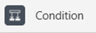

# **Workflow Tool Powerautomate für Coder**
## **Dokumentation**

### **Inhalt**

1. [Grundlagen Poweapps](#grundlagen-powerapps)

### **Grundlagen Powerapps**
In diesem Kapitel werden die relevantesten Funktionen von Powerapps und Powerautomate erklärt, die für die Entwicklung von Workflows und Automatisierungen in der Microsoft Power Platform verwendet werden.

#### **Grundfunktionen**

`Condition`:

Condition ist eine **Wenn-Bedingung**. Sie ermöglicht es, verschiedene Aktionen basierend auf bestimmten Bedingungen auszuführen.
> **z.B.** ìf()` in PowerApps.

Er bietet die Möglichkeit von zwei Pfaden, die ausgeführt werden, wenn die Bedingung erfüllt ist (True) oder nicht erfüllt ist (False).

`Apply to each`:

Apply to each ist eine **Schleife**, die es ermöglicht, eine Aktion für jedes Element in einer Sammlung auszuführen und diese auch zu wiederholen.

`Initialize variable`:

Initialize variable ist eine **Variable**, die in Power Automate verwendet wird, um Werte zu speichern und zu verwalten.
> **z.B.** `erstellt eine Variable mit dem Namen "myVariable" und dem Wert "Hello World"`.

`Set variable`:

Set variable ist eine **Variable**, die in Power Automate verwendet wird, um den Wert einer bereits initialisierten Variable zu ändern.
> **z.B.** `ändert den Wert der Variable "myVariable" auf "Goodbye World"`.

`Append to array variable`:

Append to array variable ist eine **Variable**, die in Power Automate verwendet wird, um einen Wert zu einem Array hinzuzufügen.
> **z.B.** `fügt den Wert "New Item" zum Array "myArray" hinzu`.

`Send an email`:

Send an E-Mail ist eine Aktion, die es ermöglicht, eine autmatische E-Mail zu senden.
> **z.B.** `sendet eine E-Mail an XY mit dem Betreff, dem Inhalt, den Variablen und den Anhängen`.

`Get attachments`:

Get atttachments ist eine Aktion, die es ermöglicht, Anhänge von einer Liste (**z.B von einem SharePoint-Element**) zu erhalten.
`Get attachment content`:

1. [ ] Get attachment content ist eine Aktion, die es ermöglicht, den Inhalt eines Anhangs zu erhalten.
> **z.B.** `erhält den Inhalt des Anhangs "myAttachment"`.

`Respond to a PowerApp or flow`:

Respond to a PowerApp or flow ist eine Aktion, die es ermöglicht, eine Antwort an eine PowerApp oder einen Flow zu senden.
> **z.B.** `sendet eine Antwort an die PowerApp mit dem Wert "Hello World"`.

`Get items`:

Get items ist eine Aktion, die es ermöglicht, Elemente und Datensetzte aus einer SharePoint-Liste zu erhalten.
> **z.B.** `erhält alle Elemente aus der SharePoint-Liste Bestellungen, Kunde, Aufgabe`.

`Update item`:

Update item ist eine Aktion, die es ermöglicht, ein Element in einer SharePoint-Liste zu aktualisieren.

`Manually trigger a flow`:

Manually trigger a flow ist eine Aktion, die es ermöglicht, einen Flow manuell auszulösen.
> **z.B.** `löst den Flow manuell aus, wenn der Button in PowerApps gedrückt wird`.

`When a new email arrives`:

When a new email arrives ist eine Aktion, die es ermöglicht, einen Flow auszulösen, wenn eine neue E-Mail eintrifft.

`Recurrence`:

Recurrence ist eine Aktion, die es ermöglicht, einen Flow in regelmäßigen Abständen auszuführen.
> **z.B.** `führt den Flow jeden Tag um 8 Uhr aus`.

